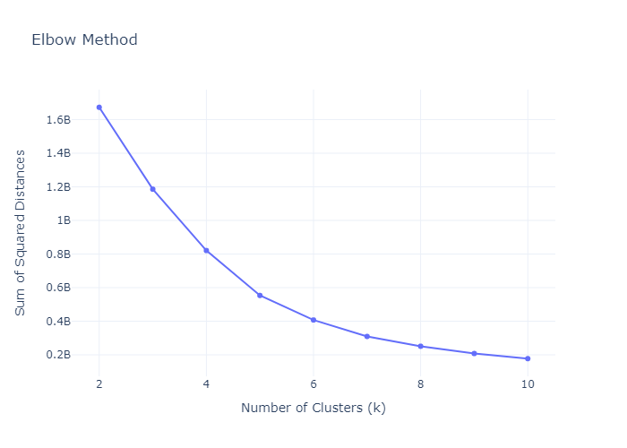

# Final Project - Book Recommendations

## Introduction
In this project, I aim to develop a book recommendation system by utilizing machine learning techniques, specifically K-means clustering, on data extracted from Goodreads. Goodreads is a popular platform where users can rate and review books, providing a rich source of information for my recommendation system.

The goal of my project is to use the power of machine learning to group books into clusters based on their attributes such as average rating, number of pages, awards, year published, subgenre, and other relevant features. By applying K-means clustering, I can identify similar books within each cluster and provide personalized recommendations based on Goodreads users' preferences.

## Description
The process involves preprocessing the Goodreads dataset, including data cleaning, feature engineering, and normalization. I will utilize the K-means algorithm to group books into clusters. The centroids of these clusters will act as representative points for the books within them.

By recommending books based on the clusters and their centroids, I aim to get personalized and more accurate book suggestions. Users can provide a book they enjoyed, and the recommendation system will identify the relevant cluster and recommend books from that cluster, enhancing their reading experience and introducing them to new titles within their preferred characteristics.

### Data Characteristics
Check the link for Tableau to see some

### Preprocessing
For the model I will only use books classified as LITERATURE.

First I had to remove all entries the with Non-ASCII Characters since they are not properly read by NLTK sentiment analyzer.

I removed some qualitative data such as review count, title, author name, recommended books, books series. Then I used `StandardScaler()` to make rating count more readble for the model and used a dictionary to transform the genres type to integers

Finally I drew a correlation matrix to check if I had any features very closely related to one another that would make clustering more difficult:

As rating count was closely related to all the star ratings, I decided to drop theses five features as well. 

This is the final matrix:

Final features are:
 1. **Series:** If the book belongs to a sequel collection
 2. **Average rating:** Taken from the Goodreads users
 3. **Number of pages**
 4. **Awards:** Number of relevant awards cited in Goodreads
 5. **Year published**
 6. **Genre**
 7. **Compound Score:** NLTK
 8. **Coleman Liau Index:** Coleman-Liau Index provides an estimate of the grade level required to understand the text, based on characters instead of syllables.
 9. **Rating count**.

### Modelling
When making Recommendations Systems we don't have a definitive outcome as a single result. There are many possiblities of outcomes depending on the input you provide. Therefore **Unsupervised Learning** plays an important role in building recommendation systems by clustering similar items or identifying patterns, it can suggest recommendations based on **item similarities**.

In order to find adequate the number of clusters I used 3 different tecniques.

#### Elbow Method
The elbow method involves plotting the number of clusters on the x-axis and the corresponding sum of squared distances on the y-axis. As the number of clusters increases, the distances typically decreases since each data point gets assigned to a closer centroid. However, beyond a certain point, the decrease in distortion becomes less significant, resulting in a less pronounced improvement in clustering performance.

Since the Elbow Method didn't provide a distinct visual decrease in improvement. I tried a couple of different indexes.

#### Davies-Bouldin Index
The Davies-Bouldin Index is a measure of the quality of clustering in machine learning. It is used to evaluate the separation and compactness of clusters obtained from clustering algorithms.

The index is calculated by considering pairwise distances between clusters. For each cluster, the Davies-Bouldin Index computes the average similarity between that cluster and all other clusters.

A lower Davies-Bouldin Index indicates better clustering performance.

#### Silhouette Coefficient
The Silhouette Coefficient is a metric used to evaluate the quality of clustering in machine learning. It measures how well each data point fits into its assigned cluster based on its proximity to other points in the same cluster compared to points in other clusters. The coefficient ranges from -1 to 1, where a higher value indicates better clustering performance. A value close to 1 means the data point is well-matched to its cluster and poorly-matched to neighboring clusters, while a value close to 0 suggests the data point is on the boundary between clusters. A value close to -1 indicates that the data point may be assigned to the wrong cluster.

Provided that 2 out of the 3 methods indicate a number of clusters between 6 and 8, combined with the information from the Davies-Boulding Index, the total of seven clusters seems adequate.

#### Clustering

**KMeans++** was chosen as the clustering model for this project due to its effectiveness in initializing the cluster centroids. Compared to the standard KMeans algorithm, KMeans++ utilizes a smarter initialization scheme. It selects the initial centroids in a way that ensures better spread across the dataset, leading to improved clustering performance. This makes it a suitable choice for the book recommendation task, where accurate clustering is crucial for providing meaningful and relevant recommendations to users.

## Technologies
- Scikit-learn
- Numpy
- Plotly
- Regex
- Natural Language Toolkit
- Tableau
- Streamlit

## Launch
1. Git clone this repo;
2. Open your terminal;
3. Run `main.py` file;
4. Choose an index for a book you enjoyed in my list;
5. Get a recommendation.

## Future features